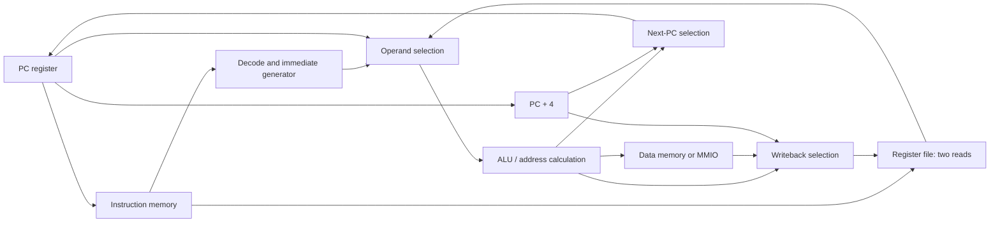

# Architecture: the machine you will build

This course builds two implementations of one small computer: a single-cycle CPU, then a five-stage CPU that executes the same programs. The instruction set describes what a program observes. The microarchitecture describes the circuits and clock-by-clock steps that produce that behavior. Keeping the first fixed lets us improve the second and check that the answers stay the same.

This is an educational subset of RV32I, not a claim of full RISC-V compliance. The first milestone implements 14 instructions; the extended milestone implements the 37 integer computation, load, store, branch, and jump instructions listed below. `FENCE`, `ECALL`, `EBREAK`, and unsupported encodings stop execution with a defined fault. There are no caches, interrupts, control/status registers (CSRs), privilege modes, operating system, multiplication, division, or compressed instructions. The official specification explicitly discusses pedagogical subsets, but full RV32I includes instructions outside this course's implemented set. [RV32I specification, version 2.1](https://docs.riscv.org/reference/isa/v20240411/unpriv/rv32.html)

## 1. The contract shared by both CPUs

| Item | Course rule |
|---|---|
| Word and instruction width | 32 bits |
| Registers | `x0` through `x31`, each 32 bits; reading `x0` always returns zero; writes to `x0` are discarded |
| Program counter | A 32-bit byte address; reset value `0x00000000` |
| Instruction alignment | Four bytes; normal next instruction is `pc + 4` |
| Arithmetic | Low 32 bits of the result; overflow does not halt execution |
| Data byte order | Little endian: lowest-addressed byte holds the least significant eight bits |
| Instruction memory | Separate 256 × 32-bit array; byte addresses `0x00000000`–`0x000003ff`; legal fetch starts `0x000`–`0x3fc` in steps of four |
| Data memory | Separate 256 × 32-bit array; byte addresses `0x00000000`–`0x000003ff` |
| Memory ports | Asynchronous reads, writes accepted on the rising clock edge |
| Invalid access | Fault; the failing instruction changes no register, RAM byte, or peripheral |
| Halt recovery | Reset |

The two memories have **independent address spaces selected by the port**. Instruction fetch at address zero reads instruction word zero. `lw x1, 0(x0)` reads data word zero. `sw x1, 0(x0)` changes data word zero and cannot change program code. This Harvard arrangement avoids an instruction-fetch/data-access port conflict. It also means an ordinary unified-memory software loader cannot be used unchanged: provide separate instruction and data images.

Check the entire 32-bit address before indexing either array. Only after validation use `address[9:2]` as the word index. Otherwise, address `0x400` could silently wrap to word zero.

The register, alignment, and byte-order choices follow the applicable RV32I behavior; the memory capacities, reset values, address map, and halt interface are course platform choices. [RV32I programmer's model and load/store rules](https://docs.riscv.org/reference/isa/v20240411/unpriv/rv32.html)

## 2. From wires to a complete datapath

A **combinational circuit** computes outputs from current inputs: gates, adders, multiplexers, the decoder, and the arithmetic/logic unit (ALU). A **register** preserves bits across time and changes on a clock edge. Memory combines storage with circuits that select an entry.



An instruction does not travel as a physical object. Its bits select paths and enable writes. For `lw x5, 12(x2)`, the register file supplies `x2`, the immediate generator supplies 12, the ALU adds them, data memory returns a word, and writeback selects that word for `x5`.

The register file has two combinational read ports and one rising-edge write port. A write requires `reg_write && rd != 0`. Force a read whose index is zero to return zero even if storage for entry zero exists.

## 3. Instruction fields and supported operations

These field diagrams are organized from bit 31 on the left to bit 0 on the right. `rd` selects a destination; `rs1` and `rs2` select sources. `funct3` and `funct7` further identify an operation inside an opcode group.

```text
R: [ funct7:7 ][ rs2:5 ][ rs1:5 ][funct3:3][ rd:5 ][opcode:7]
I: [       imm[11:0]:12        ][ rs1:5 ][funct3:3][ rd:5 ][opcode:7]
S: [imm[11:5]:7][ rs2:5 ][ rs1:5 ][funct3:3][imm[4:0]:5][opcode:7]
B: [imm[12]][imm[10:5]:6][rs2:5][rs1:5][funct3:3][imm[4:1]:4][imm[11]][opcode:7]
U: [                    imm[31:12]:20                   ][rd:5][opcode:7]
J: [imm[20]][imm[10:1]:10][imm[11]][imm[19:12]:8][rd:5][opcode:7]
```

The decoder's fixed positions are `opcode = instruction[6:0]`, `rd = [11:7]`, `funct3 = [14:12]`, `rs1 = [19:15]`, `rs2 = [24:20]`, and `funct7 = [31:25]`. A field is a register index only for instructions that actually use that source. The encoding definitions are published in the official [riscv-opcodes base integer table](https://github.com/riscv/riscv-opcodes/blob/master/extensions/rv_i).

Construct immediates by wiring bits together. `sext` means repeat the most significant bit until the result is 32 bits; braces below mean concatenation.

```text
I = sext(instruction[31:20])
S = sext({instruction[31:25], instruction[11:7]})
B = sext({instruction[31], instruction[7], instruction[30:25],
          instruction[11:8], 1'b0})
U = {instruction[31:12], 12'b0}
J = sext({instruction[31], instruction[19:12], instruction[20],
          instruction[30:21], 1'b0})
```

B and J already include their low zero bit; do not shift them a second time. Their encoded offsets can describe a two-byte boundary, but this machine accepts only four-byte-aligned instruction targets. These layouts can be checked against the [official immediate-format diagrams](https://docs.riscv.org/reference/isa/v20240411/unpriv/rv32.html#_immediate_encoding_variants).

| Group | Initial 14-instruction milestone | Add for the 37-instruction milestone |
|---|---|---|
| Register ALU | `ADD SUB AND OR XOR SLT` | `SLL SRL SRA SLTU` |
| Immediate ALU | `ADDI` | `SLTI SLTIU XORI ORI ANDI SLLI SRLI SRAI` |
| Loads | `LW` | `LB LH LBU LHU` |
| Stores | `SW` | `SB SH` |
| Branches | `BEQ` | `BNE BLT BGE BLTU BGEU` |
| Jumps | `JAL JALR` | — |
| Upper immediate | `LUI AUIPC` | — |

Use the official encoding tables to decide legal `funct3`/`funct7` combinations, including RV32 shift-immediate restrictions. Testing only the opcode will accidentally accept instructions such as `MUL`. The RV32-specific shift encodings appear in [riscv-opcodes `rv32_i`](https://github.com/riscv/riscv-opcodes/blob/master/extensions/rv32_i).

For the course ALU, compare signed values explicitly for `SLT/SLTI/BLT/BGE`; compare unsigned values for their `U` variants. Right arithmetic shift replicates bit 31. Register shifts use `rs2[4:0]`. Logical immediates and `SLTIU` use the sign-extended I immediate. The final result still occupies 32 bits. [RV32I integer operations](https://docs.riscv.org/reference/isa/v20240411/unpriv/rv32.html#_integer_computational_instructions)

## 4. Control signals turn the datapath into instructions

`A` and `B` are ALU inputs. `result` is the value offered to writeback. A dash means the instruction must not activate that action, not that uninitialized control signals are acceptable.

| Class / opcode | Reads | A | B | ALU / comparison | Result for `rd` | Memory action | Next PC when valid |
|---|---|---|---|---|---|---|---|
| Register ALU / `0x33` | rs1, rs2 | rs1 | rs2 | selected ALU operation | ALU | — | pc + 4 |
| Immediate ALU / `0x13` | rs1 | rs1 | I or shift amount | selected ALU operation | ALU | — | pc + 4 |
| Load / `0x03` | rs1 | rs1 | I | add | extended memory data | read | pc + 4 |
| Store / `0x23` | rs1, rs2 | rs1 | S | add | — | write rs2 with byte mask | pc + 4 |
| Branch / `0x63` | rs1, rs2 | pc | B | target add; separate register comparison | — | — | target if condition, else pc + 4 |
| JAL / `0x6f` | none | pc | J | add | pc + 4 | — | ALU target |
| JALR / `0x67` | rs1 | rs1 | I | add; clear target bit 0 | pc + 4 | — | masked target |
| LUI / `0x37` | none | zero | U | pass/add | U | — | pc + 4 |
| AUIPC / `0x17` | none | pc | U | add | ALU | — | pc + 4 |

Here `pc` is the address of **that instruction**, carried through the pipeline; it is not the current fetch PC. Likewise, link writeback uses that instruction's `pc + 4`. Validate JALR alignment after clearing target bit zero. A branch that is not taken does not fault merely because its unused target is misaligned. [RV32I control transfers](https://docs.riscv.org/reference/isa/v20240411/unpriv/rv32.html#_control_transfer_instructions)

Start every combinational decode with safe defaults: no register write, no memory write, no redirect, and an illegal-instruction marker. Clear the marker only after all required encoding fields pass and the instruction belongs to the current milestone. This prevents an unrecognized instruction from inheriting the previous instruction's controls.

```text
decode(instruction):
    controls = safe_defaults
    validate opcode, funct3, funct7 and any fixed fields
    if legal and enabled in this milestone:
        select controls from the class and operation
        fault = NONE
    else:
        fault = ILLEGAL_INSTRUCTION or UNSUPPORTED_INSTRUCTION

execute(valid_instruction):
    obtain actual operands, including forwarding when pipelined
    calculate result, address, and branch condition
    validate an actually selected control-flow target's alignment
    request a register/memory update only if valid and fault-free
```

`ILLEGAL_INSTRUCTION` means no accepted encoding matches. `UNSUPPORTED_INSTRUCTION` means a recognized instruction is excluded from the selected milestone, including `FENCE`, `ECALL`, and `EBREAK`. Both have identical stop behavior. These are course debug names, not privileged-ISA trap-cause numbers.

## 5. Data memory, byte lanes, and I/O

For a data address `a`, the aligned word address is `a & 0xfffffffc` and the byte offset is `a[1:0]`. The valid RAM range is 0–1023. `LB/LBU/SB` accept any byte address in that range. `LH/LHU/SH` require `a[0] == 0`; `LW/SW` require `a[1:0] == 0`. The full access must fit within the RAM range. Reject misaligned accesses rather than splitting them across words.

For stores, lane 0 means bits 7:0 of the word, and `wmask[k]` controls byte lane `k`:

| Store | Accepted byte offsets | Four-bit mask | Data on the 32-bit memory write bus |
|---|---|---|---|
| SB | 0, 1, 2, 3 | `0001 << offset` | `(rs2 & 0xff) << (8 * offset)` |
| SH | 0, 2 | `0011 << offset` | `(rs2 & 0xffff) << (8 * offset)` |
| SW | 0 | `1111` | rs2 |

Only masked bytes change. A convenient load intermediate is `shifted = read_word >> (8 * offset)`. `LB` sign-extends `shifted[7:0]`; `LBU` zero-extends it. `LH` and `LHU` do the same for 16 bits. `LW` returns all 32 bits. For example, RAM word `0x80ff7f01` places bytes `01 7f ff 80` at ascending addresses. Byte load at offset 3 returns `0xffffff80` for `LB` and `0x00000080` for `LBU`.

These masks are this memory implementation's wiring; the byte behavior follows the [RV32I load/store definition](https://docs.riscv.org/reference/isa/v20240411/unpriv/rv32.html#_load_and_store_instructions).

| Data-port address | Access | Meaning |
|---|---|---|
| `0x00000000`–`0x000003ff` | RAM loads/stores of implemented sizes | Data RAM |
| `0x10000000` | LW/SW only, aligned | LED register; low 16 bits stored and driven to LEDs; read returns zero-extended stored bits |
| `0x10000004` | LW only, aligned | Synchronized switch register; low 16 bits contain switch inputs, high bits zero |
| Everything else | None | Access fault |

`SB`, `SH`, `LB`, `LBU`, `LH`, and `LHU` to either peripheral address fault, even when naturally aligned. Writing the switch register faults. A load to `x0` must still validate the access; discarding the result does not excuse an invalid address. The MMIO map and size restrictions are platform choices permitted by the ISA's execution-environment model. [RV32I memory access rules](https://docs.riscv.org/reference/isa/v20240411/unpriv/rv32.html#_load_and_store_instructions)

Switches are external to the CPU clock. Pass each input bit through two clocked synchronizer stages and expose only stage two. This reduces metastability risk; it does not debounce a mechanical switch or guarantee that a multi-bit switch change is sampled as one atomic event. Software experiments should hold the selected switch pattern stable before checking it.

Both memories use combinational reads and rising-edge writes to preserve the simple timing model. Request or infer a small distributed/LUT memory implementation when the selected FPGA supports it, and inspect the synthesis report. Many dedicated block-RAM configurations have registered reads. Substituting such a memory changes the design's timing contract and requires new stages or wait-state control; it is an extension exercise, not a drop-in replacement.

## 6. First implementation: one instruction per cycle

During a cycle, the current PC selects an instruction, the instruction selects registers, the ALU calculates, and the selected memory or ALU result reaches the writeback input. At the rising edge, a valid instruction updates the PC and any enabled destination. A store writes RAM or the LED register at that same edge.

For a faulting instruction, gate off every write, hold the PC at its instruction address, capture the debug fault record, and assert `halted`. A normal load to `x0` still completes and advances the PC, but does not write the register file.

The clock period must cover the longest register-to-register combinational path plus register/setup and clock uncertainty margins. In this organization, a load is a likely long path: PC → instruction memory → register read → ALU → data memory → writeback. Measure it with the FPGA timing tools; do not assume the ALU alone sets the clock rate.

## 7. Second implementation: five stages

| Stage | Work during the cycle | State captured at the next edge |
|---|---|---|
| IF: instruction fetch | Read instruction at fetch PC; predict sequential PC + 4 | IF/ID: valid, PC, instruction, fetch fault, token ID |
| ID: decode | Decode, form immediate, read operands, apply WB-to-ID bypass | ID/EX: prior metadata, controls, source indices/values, destination |
| EX: execute | Forward operands, run ALU and comparator, resolve branch/jump | EX/MEM: result/address, forwarded store value, redirect-derived next PC, controls/fault |
| MEM: memory | Validate and read/write RAM or MMIO | MEM/WB: final writeback value, memory-event metadata, controls/fault |
| WB: writeback | Write register and emit ordered retirement record | Architectural register state and debug outputs |

A **valid bit** says whether a pipeline register contains a real instruction. A bubble is `valid = 0`; its other bits may hold old values, but they must not cause a write, redirect, retirement, or fault. Carry `pc`, instruction bits, and all needed controls with each valid instruction.

Instruction fetch and data access can operate simultaneously because they use different memories. There is one writeback port, and in-order movement allows at most one instruction to use it per cycle.

### Forwarding: use a result before it reaches the register file

Select each EX source independently. A qualifying producer must be valid, fault-free, write a nonzero `rd`, and match a source the consumer actually uses. For the newest matching value, use this priority:

1. EX/MEM result, **only when that producer is not a load**.
2. MEM/WB final writeback value, including load data.
3. The value captured from the register file in ID.

For jumps, the forwarded value is the link `pc + 4`; for `LUI/AUIPC`, it is their computed register result. Never forward a load's effective address as though it were loaded data.

Apply forwarding to branch comparison operands, the JALR base, and the store-data value as well as ALU arithmetic. A store uses a forwarded rs1 for its address and a separately forwarded rs2 for its data; selecting the S immediate as ALU input B must not erase store-data forwarding.

Add an explicit WB-to-ID bypass: when WB writes a register that ID reads in the same cycle, ID captures the WB value. This removes dependence on whether a simulation array or FPGA register-file implementation reads old or new data at a simultaneous write.

### One bubble for an immediate load consumer

The baseline consumes all register operands in EX, including store data. If ID uses a register that the load in EX will write, keep PC and IF/ID unchanged for one edge, set the next ID/EX valid bit to zero, and let EX/MEM and MEM/WB advance.

```text
load_use = ID.valid && EX.valid && EX.is_load && EX.rd != 0 &&
           ((ID.uses_rs1 && ID.rs1 == EX.rd) ||
            (ID.uses_rs2 && ID.rs2 == EX.rd))
```

This depends on decoded `uses_rs1/uses_rs2`, not merely instruction bit positions. `LUI` and `JAL`, for example, have no register sources. The one-bubble rule applies to `lw x5, 0(x0); sw x5, 4(x0)` too. A later optimization can forward load data directly into a store in MEM, but that is outside this baseline.

Each table entry describes occupancy during a cycle; its work commits at the ending rising edge. `ID*` means the instruction is held in ID, and a dash is empty.

| Instruction | C1 | C2 | C3 | C4 | C5 | C6 | C7 |
|---|---|---|---|---|---|---|---|
| `lw x5, 0(x0)` | IF | ID | EX | MEM | WB | — | — |
| `add x6, x5, x5` | — | IF | ID* | ID | EX | MEM | WB |
| Bubble inserted into EX | — | — | — | EX | MEM | WB | — |

The hazard is recognized in C3. In C5, MEM/WB supplies the loaded value to the consumer's EX inputs. There is exactly one extra cycle.

For adjacent `add x5, x1, x2; sw x5, 0(x0)`, the ADD is in MEM while the store is in EX. EX/MEM forwards the ADD result into the store-data path. The store writes at the end of its following MEM cycle with no stall.

### Taken branches and jumps discard two younger instructions

Resolve all branches, JAL, and JALR in EX. The baseline always fetches sequentially until EX selects a redirect. On that edge, set the PC to the target and invalidate both next IF/ID and next ID/EX. Allow the control-transfer instruction itself and older instructions to advance.

| Instruction | C1 | C2 | C3 | C4 | C5 | C6 | C7 |
|---|---|---|---|---|---|---|---|
| Taken `beq` | IF | ID | EX | MEM | WB | — | — |
| Wrong-path `sw` | — | IF | ID; killed | — | — | — | — |
| Next wrong-path instruction | — | — | IF; killed | — | — | — | — |
| First target instruction | — | — | — | IF | ID | EX | MEM |

The wrong-path store never reaches MEM and never writes. A not-taken branch proceeds without a redirect penalty. A valid redirect outranks a dependency stall affecting younger instructions; otherwise a held wrong-path instruction could survive the redirect.

### Faults are ordered, even when discovered early

Stopping the entire pipeline immediately at a decode fault would lose older results still in flight. Instead, attach a fault marker to the instruction token and move it through the pipeline without its ordinary side effects. Fetch, decode, and EX can discover faults; data-access faults are decided by MEM.

When a surviving fault reaches MEM:

1. Suppress its register, memory, and peripheral updates.
2. Clear all younger pipeline valid bits, ignore their redirects, and stop new fetches.
3. Allow an older instruction in WB to retire at the current edge.
4. Move the fault token to WB. At the next edge, emit its fault record, set `halted`, and keep the pipeline empty.

This works because younger instructions have not yet reached a stage with architectural side effects. An EX branch redirect kills younger fault tokens in IF or ID. An older fault in MEM instead overrides an EX redirect. This ordering is essential: a wrong-path illegal instruction must not halt the CPU, and a younger store must not escape after an older fault.

For an aligned target outside instruction memory, the control-transfer instruction completes; the fetch at the target carries an `INSTRUCTION_ACCESS` fault. A selected misaligned target produces `INSTRUCTION_MISALIGNED` on the branch/jump itself and suppresses its link write. That distinction follows the [ISA control-transfer exception rules](https://docs.riscv.org/reference/isa/v20240411/unpriv/rv32.html#_control_transfer_instructions).

The global front-end priority is:

```text
reset
  > already halted / draining a selected MEM fault
  > fault in MEM: kill younger instructions, drain older WB
  > valid fault-free EX redirect: redirect PC, flush IF and ID
  > load-use dependency: hold PC and IF/ID, bubble ID/EX
  > normal advance
```

Fault-token advancement and older-stage advancement still occur when the front end is stopped. Do not implement this as an enable that freezes every pipeline register.

The debug interface records `fault_code`, `fault_pc`, `fault_instruction`, and `fault_address` where relevant. Use the names `ILLEGAL_INSTRUCTION`, `UNSUPPORTED_INSTRUCTION`, `INSTRUCTION_MISALIGNED`, `INSTRUCTION_ACCESS`, `LOAD_MISALIGNED`, `LOAD_ACCESS`, `STORE_MISALIGNED`, and `STORE_ACCESS`; no numeric encoding is prescribed. For a data request that is both misaligned and outside its region, report misalignment first. An invalid fetch has no instruction bits; mark that field invalid rather than inventing a decoded word.

## 8. Reset is a hardware operation, not a program instruction

The CPU-facing reset is active high and sampled at a rising edge. While asserted, it holds PC at zero, clears `x1`–`x31`, clears the LED register, clears all pipeline valid bits, clears debug fault/halt state, and disables memory and register writes. Synchronizer state is cleared too. Use a board wrapper that meets the chosen device's reset timing; an external push button must not be wired directly into ordinary synchronous logic without suitable conditioning.

Reset **does not clear or reload instruction memory or data RAM**. Instruction contents come from a program image loaded before execution. Simulations explicitly initialize data RAM from a known image, normally zero. Board programs initialize every RAM location they rely on. A later reset restarts the program while retaining RAM contents. This distinction keeps the core contract independent of FPGA power-up initialization facilities.

In tests, assert reset across at least two rising edges and deassert away from the sampling edge. After release, the single-cycle CPU starts at PC zero; the pipeline begins empty and must fill before its first retirement.

## 9. CPI and clock period answer different questions

**Cycles per instruction (CPI)** measures cycles divided by successfully retired instructions. Execution time also depends on clock period:

```text
execution time = instruction count × CPI × clock period
```

A single-cycle implementation has CPI near 1 for ordinary execution, but its clock must accommodate a whole instruction. An ideal five-stage pipeline takes `N + 4` cycles to retire `N` instructions from an empty pipeline. For this baseline, add one cycle per load-use stall and two per taken redirect, counting actual nonoverlapping penalty cycles. Exclude reset and a fault-stop tail when comparing the useful instruction sequence.

Example with deliberately invented timing numbers: 100 instructions, ten load-use stalls, and ten taken redirects require `100 + 4 + 10 + 20 = 134` pipeline cycles. If the single-cycle period is 20 ns and the pipeline period is 6 ns, execution times are 2000 ns and 804 ns, a speedup of about 2.49. Pipeline CPI is 1.34 here; a larger CPI can still produce a faster program when the clock period is much shorter.

Those numbers are a calculation exercise, not FPGA results. Report measured clock constraints, timing slack, actual cycles, and retired instruction counts before claiming a performance improvement.

## 10. Completion criteria and sources

The single-cycle and pipeline versions are complete for a milestone only when they satisfy the same architectural tests, differ only in timing, and suppress every wrong-path or faulting side effect. Use [VERIFICATION.md](VERIFICATION.md) to make that claim with evidence.

Primary references used to check ISA details:

- [RISC-V Unprivileged ISA, RV32I version 2.1, pinned 2024 edition](https://docs.riscv.org/reference/isa/v20240411/unpriv/rv32.html): registers, formats, arithmetic, control transfers, memory behavior, and subset boundaries.
- [RISC-V official base integer opcode definitions](https://github.com/riscv/riscv-opcodes/blob/master/extensions/rv_i): instruction encodings and fixed fields.
- [RISC-V official RV32 integer opcode definitions](https://github.com/riscv/riscv-opcodes/blob/master/extensions/rv32_i): RV32 shift-immediate encodings.

The pipeline, reset, MMIO, and fault-drain mechanisms above are the course's design contract. They are not a prescribed RISC-V implementation.
